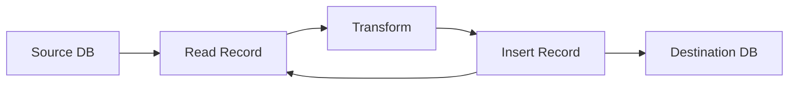
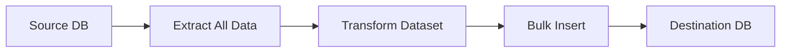
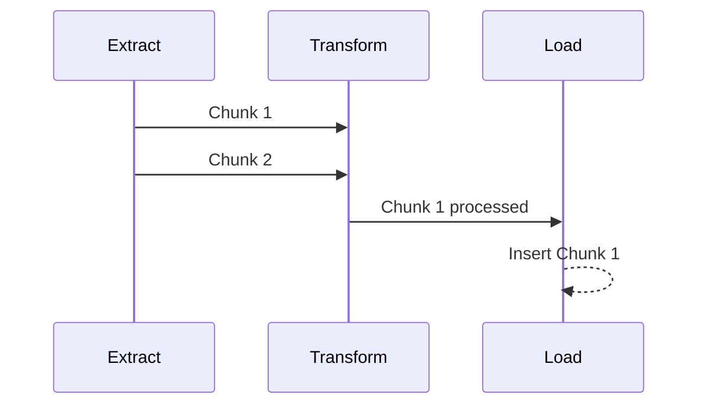

# ETL Benchmarking System

This project evaluates the performance of three different ETL (Extract–Transform–Load) strategies for transferring structured data between a source SQLite database and a destination SQLite database.

The goal is to analyze how execution patterns such as sequential processing, staged execution, and parallel pipelining behave as dataset size increases.

---

## 📌 Overview

The system simulates a real-world ETL workflow where records are:

1. Extracted from a source database
2. Transformed using a fixed rule set
3. Loaded into a destination database

Each strategy implements this workflow differently, allowing us to compare execution efficiency under varying workloads.

---

## 📊 Dataset Configuration

The benchmark uses progressively increasing dataset sizes:

* 300,000 records (3L)
* 600,000 records (6L)
* 900,000 records (9L)
* 1,200,000 records (12L)
* 1,500,000 records (15L)

---

## 🧾 Schema

```text
name | roll_no | email | phone_number
```

---

## 🔄 Transformation Rules

Each record undergoes the following transformations:

* `name` → converted to uppercase
* `roll_no` → prefixed with `RN_`
* `email` → converted to uppercase
* `phone_number` → prefixed with `+91`

---

## ⚙️ ETL Strategies

### 1️⃣ Sequential Row-wise ETL (`case1_direct`)

This approach processes one record at a time.




**Characteristics:**

* Minimal logic complexity
* High number of database operations
* Serves as a baseline for comparison

---

### 2️⃣ Staged ETL (`case2_staged`)

This strategy separates extraction, transformation, and loading into distinct phases.




**Characteristics:**

* Reduced database round-trips
* Better batching efficiency
* No overlap between stages

---

### 3️⃣ Parallel Chunk-based ETL (`case3_parallel`)

This approach introduces chunking and concurrency using multiple threads.




**Characteristics:**

* Uses chunk-based batching
* Overlaps ETL stages
* Reduces idle time between operations
* Performance depends on chunk size

---

## 🧩 Chunk Size Configuration

For the parallel pipeline, multiple chunk sizes are tested:

* 1 MB
* 2 MB
* 5 MB
* 6 MB

The optimal chunk size is determined based on execution time.

---

## 📁 Project Structure

```text
config/
db/
data_generator/
etl/
results/
runtime/
utils/
main.py
requirements.txt
```

---

## ▶️ Execution

### Install dependencies

```powershell
py -3 -m pip install -r requirements.txt
```

### Run full benchmark

```powershell
py -3 main.py
```

### Run with custom parameters

```powershell
py -3 main.py --sizes 300000 600000 --chunk-sizes-mb 1 2 5 6
```

### Generate dataset manually

```powershell
py -3 data_generator\generate_data.py --records 300000
```

---

## 📈 Output Artifacts

The system generates the following outputs inside the `results/` directory:

* `results.csv` → raw benchmark data
* `results_table.png` → tabular comparison
* `benchmark_plot.png` → performance visualization

---

## 📊 Results Interpretation

The generated outputs help answer:

* How does sequential ETL scale with data size?
* Does batching significantly improve performance?
* How much benefit is gained from parallel execution?
* Which chunk size yields optimal performance?

---

## 📉 Sample Results

### Result Table
\


```text
results/results_table.png
```

### Performance Plot


```text
results/benchmark_plot.png
```

---

## 🔍 Key Observations

Typical observations from the benchmark:

* Sequential ETL becomes inefficient as dataset size increases
* Staged ETL improves performance due to batching
* Parallel ETL achieves the best performance due to overlapping stages
* Chunk size plays a critical role in optimizing throughput

---

## 🔄 Reproducibility

* Dataset generation is deterministic
* Identical chunk sizes are used across all runs
* Row counts and transformations are validated after execution

---

## 🧠 Conclusion

This project demonstrates how different ETL execution models impact performance under increasing data loads. It highlights the importance of batching and concurrency in designing scalable data pipelines.

---

